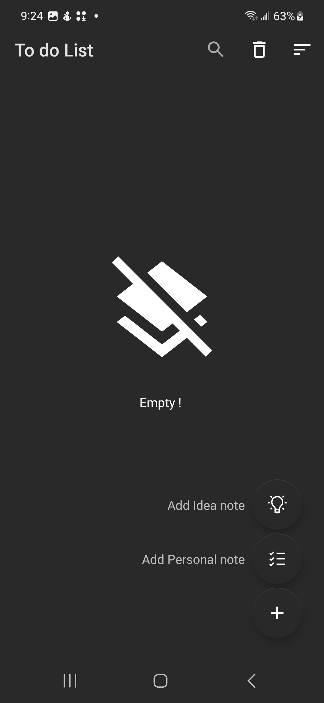
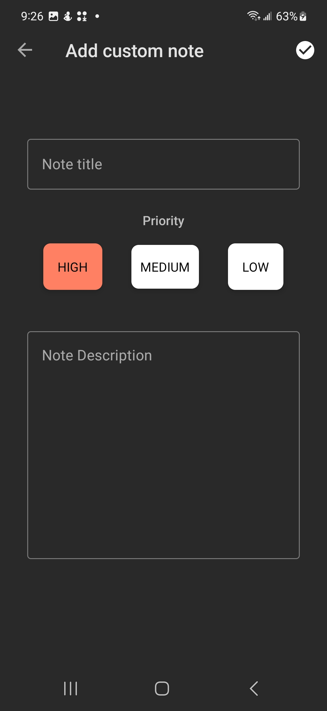

#  <h1 align="center">📝 NotesApp </h1>
# 

  NotesApp is a simple Android app for managing notes and to-do lists. With NotesApp , you can quickly add, delete, and update notes, as well as generating Todo Ideas from BoredApi.</>
  
#  <h1 align="center">🖼 Preview</h1>

<table>
  <tr>
    <td></td>
    <td></td>
    <td></td>
  </tr>
 </table>

<h2 align="center">Features⭐</h2>

- Add, delete and update your todo list.
- Generate Todo Ideas from BoredApi (Network required)
- Sort your notes.
- Search for a Todo by taping the title or any word from Todo Description.
- Edit priority of your Todo Ideas.

<h2 align="center">Architecture ☁</h2>

This app follows the MVVM (Model-View-ViewModel) architecture pattern.

#  <h1 align="center">📚 What i used for this app </h1>

- ROOM Database
- Data binding
- RecyclerView
- Jetpack Datastore
- LiveData
- Coroutines
- Repository
- Navigation Component 
- Transition Animation
- DiffUtil
- CRUD operations

